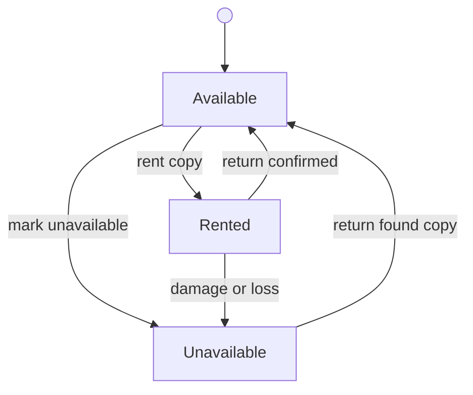
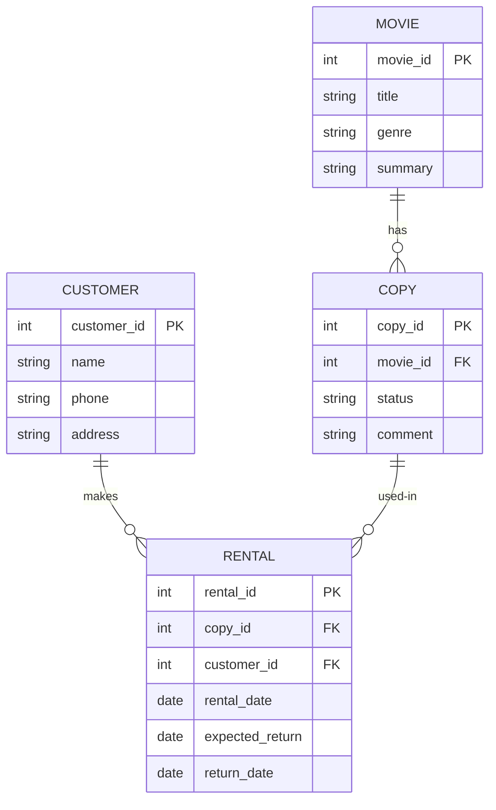

# Domain Model — Stage 2: Visual Basic 6
# VCM-v2 — Video Club Manager

> This document defines the entities, relationships, state transitions, and invariants
> of the VCM-v2 domain. It does not define how the system is built. See tech.md for that.
> When in conflict with the PRD, the PRD wins. When in conflict with master-context.md, that wins.

---

## 1. Entities

### Movie

Represents a film title in the catalog.

| Attribute | Type    | Notes                                                        |
|-----------|---------|--------------------------------------------------------------|
| movie_id  | Integer | System-assigned, sequential, not zero-padded (1, 2, 10…)    |
| title     | String  | Required                                                     |
| genre     | String  | Required. Stored as plain text on the movie record.          |
|           |         | Valid values come from the predefined list in config.ini.    |
| summary   | String  | Optional                                                     |

Rules:
- Movies cannot be deleted.
- A movie with no copies is effectively inactive but remains in the catalog.
- Price is not stored per movie. A single `daily_rate` applies to all movies (from config.ini).
- Genre is stored as a string, not a foreign key. No Genre table exists in the database.
  The valid genre list is defined in config.ini and used to populate the genre dropdown.

---

### Copy

Represents a specific physical VHS cassette of a movie.

| Attribute | Type         | Notes                                                        |
|-----------|--------------|--------------------------------------------------------------|
| copy_id   | Integer      | System-assigned. Formula: `movie_id x 100 + sequence`.      |
|           |              | Movie 1 copy 1 = 101. Movie 10 copy 3 = 1003.               |
| movie_id  | Integer (FK) | References Movie                                             |
| status    | Enum         | Available, Rented, Unavailable                               |
| comment   | String(30)   | Optional. Single-line. E.g. "damaged", "lost".               |

Copy code rules (BR-5):
- `copy_id = movie_id x 100 + sequence_number`
- Sequence starts at 1 per movie and increments with each new copy added.
- No zero-padding needed — the arithmetic produces the correct format naturally.
- Sequence numbers are never reused within the same movie.
- Copy codes are unique across the entire system.

Rules:
- Copies cannot be deleted.
- The Rented status is set by the system only, not by the employee directly.
- A copy may be marked Unavailable even while in Rented status (damage/loss — EC-6).
- Unavailable is not permanent. A recovered copy may return to Available (EC-3/EC-7).

---

### Customer

A registered customer of the store.

| Attribute   | Type    | Notes                                        |
|-------------|---------|----------------------------------------------|
| customer_id | Integer | System-assigned, sequential, not zero-padded |
| name        | String  | Required                                     |
| phone       | String  | Optional                                     |
| address     | String  | Optional                                     |

Rules:
- Customers cannot be deleted.
- Email is out of scope for this stage.

---

### Rental

Records a single rental transaction: one copy, one customer, one time period.

| Attribute       | Type         | Notes                                                  |
|-----------------|--------------|--------------------------------------------------------|
| rental_id       | Integer      | System-assigned                                        |
| copy_id         | Integer (FK) | References Copy                                        |
| customer_id     | Integer (FK) | References Customer                                    |
| rental_date     | Date         | Date the rental was registered                         |
| expected_return | Date         | Computed at creation: rental_date + max_rental_days    |
| return_date     | Date         | Actual return date. Null while the rental is active; non-null once returned. |

Rules:
- Only one Active Rental may exist per Copy at any time.
- A rental is considered **Active** when `return_date IS NULL`; **Returned** when `return_date IS NOT NULL`.
- There is no `status` column on Rental. Active/Returned is always derived from `return_date`.
- Charges are computed at return time from config values. No payment is recorded.

---

### Configuration (config.ini)

System-level parameters stored in a classic Windows INI file. Not editable via the UI.

```ini
[Rental]
daily_rate=2.50
late_daily_rate=4.00
max_rental_days=3
max_active_rentals=5

[Genres]
list=Action,Comedy,Drama,Horror,Sci-Fi,Documentary,Animation
```

| Parameter          | Section  | Description                                           |
|--------------------|----------|-------------------------------------------------------|
| daily_rate         | [Rental] | Standard rental price per day (applies to all movies) |
| late_daily_rate    | [Rental] | Price per day for each day beyond the allowed period  |
| max_rental_days    | [Rental] | Days before a rental is considered late               |
| max_active_rentals | [Rental] | Maximum simultaneous active rentals per customer      |
| list               | [Genres] | Comma-separated list of valid genre values            |

---

## 2. Relationships

```
Movie    --< Copy      one movie, many copies
Customer --< Rental    one customer, many rentals
Copy     --< Rental    one copy, many rentals (at most one Active at a time)
```

Key cardinality rules:
- A Movie may have zero or more Copies.
- A Copy belongs to exactly one Movie.
- A Rental references exactly one Copy and one Customer.
- A Copy may have many historical Rentals, but at most one with status Active.
- Genre has no entity in the database. It is a string value on Movie, constrained by config.ini.

---

## 3. State Transitions

### Copy status



Valid transitions:

| From        | To          | Trigger                                                                       | Actor    |
|-------------|-------------|-------------------------------------------------------------------------------|----------|
| Available   | Rented      | Rental registered                                                             | System   |
| Rented      | Available   | Return confirmed                                                              | System   |
| Available   | Unavailable | Employee marks copy unavailable                                               | Employee |
| Rented      | Unavailable | Employee marks unavailable - damage or loss; warning shown, active rental closed | Employee |
| Unavailable | Available   | Return of found or recovered copy (EC-3 / EC-7)                              | System   |

Notes:
- Unavailable is not a terminal state. A lost or damaged copy may return to Available.
- There is no Deleted state. Copies are never removed from the catalog.
- The Rented to Unavailable transition closes the active rental and displays a warning
  that an additional fee must be charged to the customer outside the system.

### Rental status


- Once Returned, a rental is closed and cannot be reopened.

---

## 4. Invariants

| ID    | Invariant                                                                         |
|-------|-----------------------------------------------------------------------------------|
| INV-1 | A Copy with status Rented must have exactly one Active Rental.                    |
| INV-2 | A Copy with status Available or Unavailable must have no Active Rental.           |
| INV-3 | A Rental may not be created for a Copy with status Rented or Unavailable.         |
| INV-4 | A Copy must reference a valid, existing Movie.                                    |
| INV-5 | expected_return must equal rental_date + max_rental_days.                         |
| INV-6 | Rental state is derived from `return_date`: NULL = Active, NOT NULL = Returned. No status column exists on Rental. |
| INV-7 | Copy codes are unique across the entire system.                                   |
| INV-8 | Copy sequence numbers within a Movie are never reused.                            |
| INV-9 | A movie genre value must match one of the entries in config.ini [Genres].         |

---

## 5. Computed Values (not stored)

| Value            | Formula                                                                              |
|------------------|--------------------------------------------------------------------------------------|
| days_rented      | max(1, return_date - rental_date) in calendar days (BR-1)                            |
| rental_charge    | If days_rented <= max_rental_days: days_rented x daily_rate                          |
|                  | Else: max_rental_days x daily_rate + (days_rented - max_rental_days) x late_daily_rate |
| is_overdue       | TODAY() > expected_return AND return_date IS NULL                                    |
| available_copies | Count of Copies for a Movie where copy.status = Available                            |

---

## 6. Conceptual Entity Diagram

> Rendered automatically by GitHub. Genre does not appear as a table — it is a string
> field on Movie, constrained by the list in config.ini.



---

## 7. What Is New in This Stage

| Concept              | Where                 | Notes                                            |
|----------------------|-----------------------|--------------------------------------------------|
| Genre / Category     | Movie.genre (string)  | Predefined list from config.ini, no DB table     |
| Customer history     | Rental (history view) | Past rentals visible in the customer form        |
| Search by title/code | Query behavior        | Free-text filter + genre dropdown on main screen |
| Copy management      | Copy entity           | Multiple copies per movie; system-assigned codes |

---

## 8. What Is Inherited from Stage 1

| Concept          | Notes                                                               |
|------------------|---------------------------------------------------------------------|
| Stock constraint | Physical copies limit access. No rental without an Available copy.  |
| Rental lifecycle | Registered, Active, Returned                                        |
| Pricing          | Flat daily rate; late fee applies beyond the allowed period         |
| Customer         | Extended in this stage with phone and address fields                |

---

*Domain model version: 1.5 — Stage 2 VB6*
*Status: Draft — pending tech.md*
